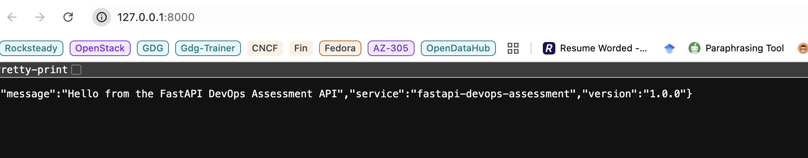
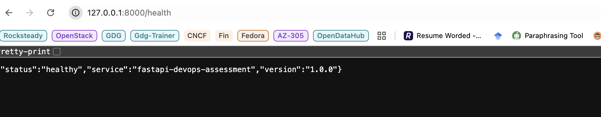
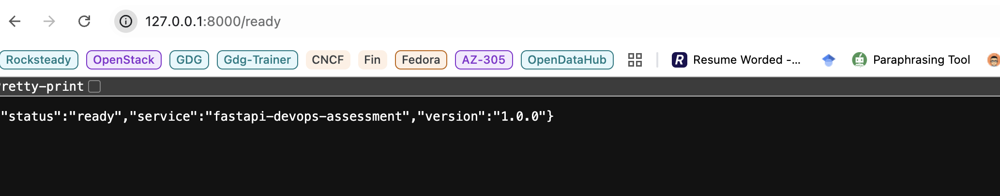
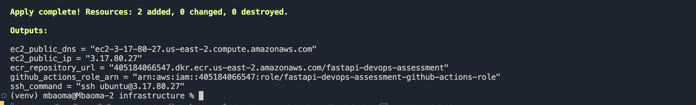
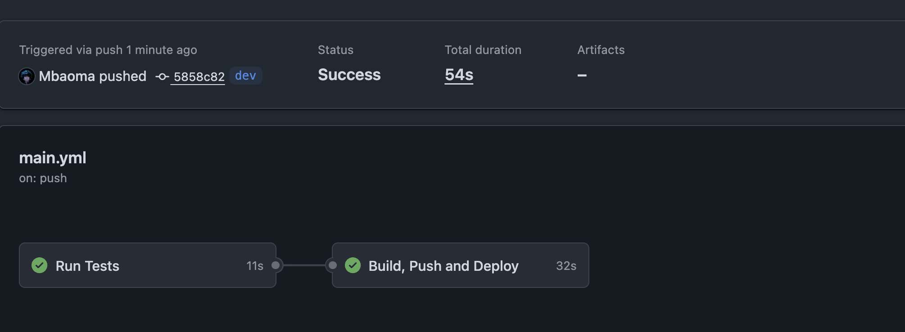
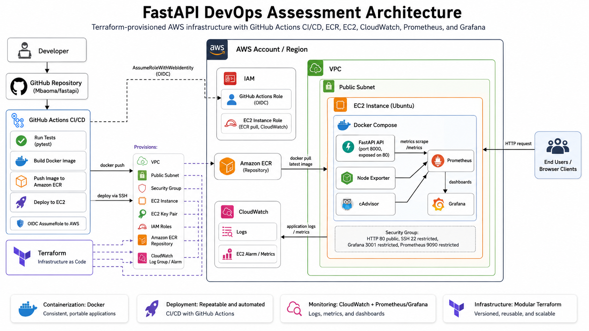
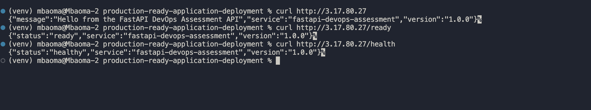
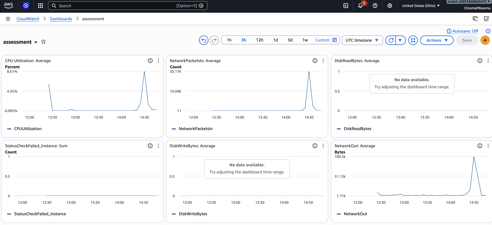
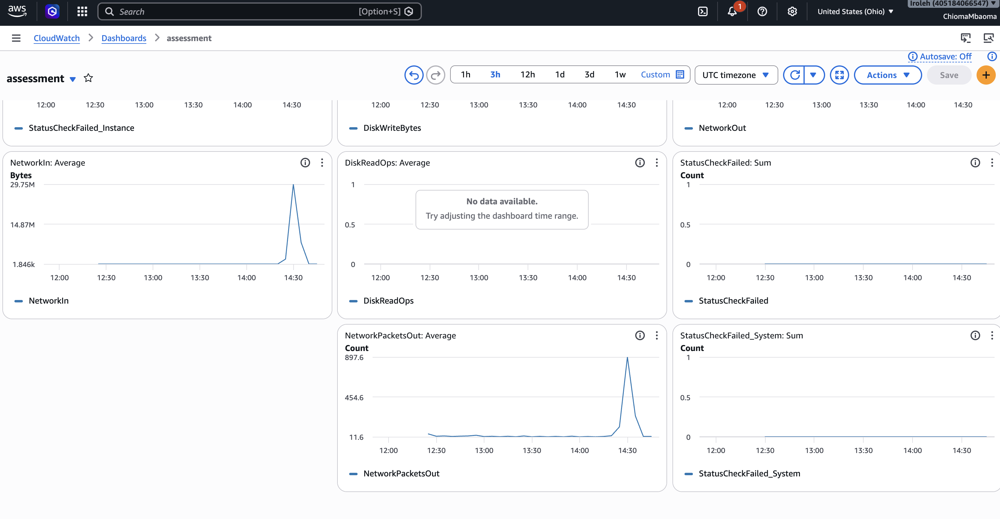

# About

Design and deploy a production-ready application (e.g. a sample web app or microservice) environment using modern DevOps practices (deployment pipeline and infrastructure).

## Features

**Infrastructure as Code**

- Use Terraform to provision infrastructure
- Infrastructure should be modular, reusable, and well-structured

**CI/CD Pipeline**
Implement a CI/CD pipeline using:
- GitHub Actions
Pipeline should include:
- Build
- Test (basic is fine)
- Deploy

**Cloud Deployment (AWS)**
Deploy your application to AWS using one of the following:
- EC2
- Deployment should be automated (no manual steps) and repeatable

**Containerization**
- Use Docker to containerize your application

**Monitoring**
- Implement basic monitoring/logging using:
- AWS CloudWatch
- Equivalent solution

**Documentation (README)**
Provide a clear and structured README that includes:
- Architecture overview
- Deployment steps
- Design decisions
- Assumptions made
- Any limitations or improvements

## The Solution

## Running the app (locally)

```python
uvicorn main:app --reload
```

The ```-reload``` command means that when you update your application code, the server will reload automatically.







## Running the app (Docker)

```bash
docker run -p 8000:8000 fast-api:v1 
```

## Seting up the infrastructure

The cloud provider is AWS, therefore ensure that your access credentials in the ```/.aws``` folder are correct.

Before running Terraform:

- Generate your SSH key locally:

```bash
ssh-keygen -t ed25519 -f ~/.ssh/fastapi-assessment -C "fastapi-assessment"
```

This creates:

```
~/.ssh/fastapi-assessment
~/.ssh/fastapi-assessment.pub
```

Terraform config uses the ```.pub``` file only.

- Run Terraform

From inside the ```infrastructure/``` directory:

```bash
terraform init
terraform fmt -recursive
terraform validate
terraform plan
terraform apply
```




- Connect to the ec2 instance

```bash
chmod 600 ~/.ssh/fastapi-assessment
ssh -i ~/.ssh/fastapi-assessment ubuntu@3.17.80.27
```

- Run the script below

```bash
sudo apt-get remove -y docker.io docker-doc docker-compose podman-docker containerd runc || true
sudo apt-get update -y
sudo apt-get install -y ca-certificates curl gnupg lsb-release unzip
sudo install -m 0755 -d /etc/apt/keyrings
curl -fsSL https://download.docker.com/linux/ubuntu/gpg | \
  sudo gpg --dearmor -o /etc/apt/keyrings/docker.gpg
sudo chmod a+r /etc/apt/keyrings/docker.gpg
echo \
  "deb [arch=$(dpkg --print-architecture) signed-by=/etc/apt/keyrings/docker.gpg] https://download.docker.com/linux/ubuntu \
  $(. /etc/os-release && echo "$VERSION_CODENAME") stable" | \
  sudo tee /etc/apt/sources.list.d/docker.list > /dev/null
sudo apt-get update -y
sudo apt-get install -y docker-ce docker-ce-cli containerd.io docker-buildx-plugin docker-compose-plugin awscli
```

## Setting up the pipeline



- After Terraform runs, add these secrets in GitHub:

```bash
AWS_REGION
AWS_ROLE_TO_ASSUME
ECR_REPOSITORY
EC2_HOST
EC2_USERNAME
EC2_SSH_KEY
```



## Access the Application

- Website: http://3.17.80.27

- Health check: http://3.17.80.27/health

- Readiness check: http://3.17.80.27/ready







```markdown
## Design Decisions

### FastAPI was used as the sample application

FastAPI was selected because it is lightweight, simple to containerize, and suitable for demonstrating a microservice-style deployment. The application exposes basic endpoints such as `/`, `/health`, and `/ready`, which are useful for testing service availability and deployment success.

### Docker was used for containerization

The application is packaged as a Docker image to ensure consistency across local, CI, and production environments. This avoids dependency issues and makes the deployment repeatable.

### Amazon ECR was used as the container registry

Amazon ECR was chosen because the application is deployed on AWS. Using ECR keeps the container image close to the runtime environment and allows the EC2 instance to pull images securely using an IAM role.

### EC2 was used as the deployment target

EC2 was selected because the assessment specifically allows EC2 as a deployment option. The instance runs Docker Compose, which makes it possible to manage the application and monitoring services from a single deployment file.

### Terraform was used for Infrastructure as Code

Terraform provisions the AWS infrastructure in a repeatable and version-controlled way. The configuration is modular, with separate modules for networking, security groups, IAM, ECR, EC2, and CloudWatch.

### GitHub Actions was used for CI/CD

GitHub Actions automates the software delivery process. On every push to the deployment branch, the workflow runs tests, builds the Docker image, pushes it to ECR, and deploys it to EC2.

### GitHub OIDC was used for AWS authentication

GitHub Actions authenticates to AWS using OIDC instead of long-lived AWS access keys. This is more secure because no permanent AWS credentials are stored in GitHub secrets.

### CloudWatch was used for AWS-native monitoring and logging

CloudWatch provides centralized logging and basic infrastructure monitoring for the EC2 instance and application containers. A CloudWatch alarm is also configured to detect EC2 instance status check failures.


## Assumptions Made

- The deployment is for a demo or assessment environment, not a full enterprise production environment.
- The application is stateless and does not require an external database.
- A single EC2 instance is sufficient for the scope of this assessment.
- Docker Compose is acceptable for orchestrating containers on the EC2 instance.
- The EC2 instance runs Ubuntu.
- The user deploying the infrastructure has valid AWS permissions to create EC2, ECR, IAM, VPC, and CloudWatch resources.
- The GitHub repository uses the `dev` branch as the deployment branch.
- The EC2 instance has internet access through a public subnet and internet gateway.
- SSH access is restricted to the deployer’s public IP address.
- Grafana and Prometheus are included for demonstration purposes and are not exposed publicly to all users.
- The application image is tagged with both the Git commit SHA and `latest`.
- Secrets such as SSH private keys and AWS role ARNs are stored in GitHub Secrets, not committed to the repository.

## Limitations and Future Improvements

### Current Limitations

- The deployment uses a single EC2 instance, so there is no high availability.
- There is no load balancer in front of the application.
- HTTPS/TLS is not configured.
- The application does not use a managed database.
- Docker Compose is suitable for this assessment but may not be ideal for larger production workloads.
- Grafana uses a demo admin password and should be secured before real production use.
- Prometheus and Grafana data persistence is limited unless Docker volumes are configured.
- Deployment is basic and does not support blue/green or canary releases.
- Rollback is manual and would require redeploying a previous image tag.
- SSH-based deployment works for the assessment, but AWS SSM would be a better production approach.
- Monitoring is basic and does not include advanced alert routing to Slack, email, or incident management tools.
- The infrastructure is deployed in one availability zone only.

### Future Improvements

- Add an Application Load Balancer in front of the EC2 instance.
- Configure HTTPS using ACM and a domain name.
- Move the application to ECS or EKS for better container orchestration.
- Add Auto Scaling Groups for high availability and self-healing.
- Store Terraform state remotely using S3 and DynamoDB state locking.
- Add separate environments such as `dev`, `staging`, and `prod`.
- Use AWS SSM Session Manager instead of SSH for deployment access.
- Add blue/green or rolling deployment strategy.
- Add persistent Docker volumes for Grafana and Prometheus.
- Add alert notifications through SNS, Slack, or email.
- Add more application-level metrics using Prometheus instrumentation.
- Add security scanning for Docker images before pushing to ECR.
- Add vulnerability scanning and static code analysis in the CI/CD pipeline.
- Add automated rollback if health checks fail after deployment.
- Replace the single EC2 instance with ECS Fargate for a more managed container runtime.
